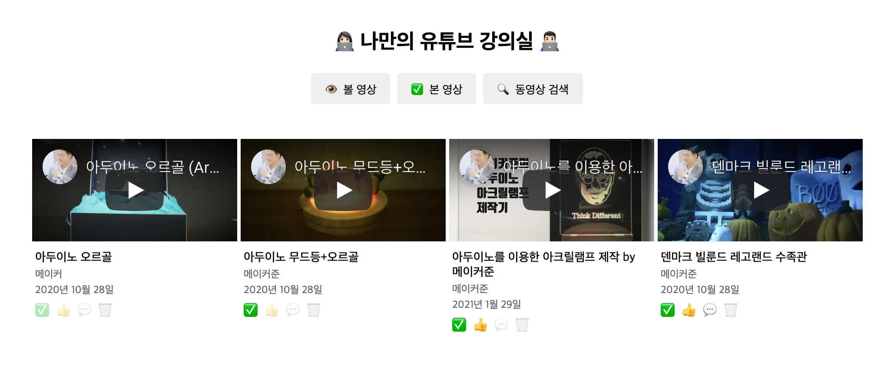

<p align="middle" >
  
</p>
<h2 align="middle">level1 - 나만의 유튜브 강의실</h2>
<p align="middle">자바스크립트와 외부 API를 이용해 구현 하는 나만의 유튜브 강의실</p>
<p align="middle">
  
  
  
  
  
</p>

## 🔥 Projects!

<p align="middle">
  
</p>

### 🎯 step1 검색 기능

- [ ] [유튜브 검색 API](https://developers.google.com/youtube/v3/getting-started?hl=ko)를 통해서, 내가 추가로 보고 싶은 영상들을 검색할 수 있다.
  - [ ] 검색 시 엔터키를 눌렀을 때와 마우스로 검색 버튼을 눌렀을 때 검색 동작이 이루어진다.
- [ ] 로딩컴포넌트: 데이터를 불러오는 중일 때, 현재 데이터를 불러오는 중임을 skeleton UI로 보여준다.
- [ ] 검색 결과가 없는 경우 결과 없음 이미지를 추가하여, 사용자에게 메시지를 보여준다.
  - [ ] 검색 결과 없음 이미지는 `src/images/status/not_found.png` 경로에 있다.
- [ ] 최초 검색결과는 10개까지만 보여준다. 더 많은 데이터는 스크롤을 내릴 때 추가로 불러온다.
  - 검색 결과 화면에서 유저가 브라우저 스크롤 바를 끝까지 이동시켰을 경우, 그다음 10개 아이템을 추가로 api요청하여 불러온다.
- [ ] 내가 검색한 영상들의 json 데이터를 `저장`할 수 있다. (실제 저장이 아닌 영상 id를 Web Storage에 저장). 단 이미 저장된 경우는 저장 버튼이 보이지 않게 한다.
- [ ] 저장 가능한 최대 동영상의 갯수는 100개이다.
- [ ] 검색 모달에 다시 접근했을 때 가장 마지막에 검색한 키워드로 검색한 결과를 보여준다.
- [ ] 최근 검색 키워드를 3개까지 화면상에 검색창 하단에 보여준다.

### 🎯🎯 step2 강의실 관리 기능

- [ ] 가장 처음에는 저장된 영상이 없음으로, 비어있다는 것을 사용자에게 알려주는 상태를 보여준다.
- [ ] 이후 페이지를 방문했을 때 기본 메인 화면은 내가 **볼 영상**들의 리스트를 보여준다.
- [ ] 영상 카드의 이모지 버튼을 클릭하여 아래와 같은 상태 변경이 가능해야 한다.
  - [ ] ✅ 본 영상으로 체크
  - [ ] 🗑️ 버튼으로 저장된 리스트에서 삭제할 수 있습니다. (삭제 시 사용자에게 정말 삭제할 것인지 물어봅니다.)
- [ ] 사용자가 버튼을 클릭했을 때 해당 행위가 정상적으로 동작하거나, 실패하였음을 `snackbar`를 통해 보여준다.
- [ ] 본 영상, 볼 영상 버튼을 눌러 필터링 할 수 있다.

### 🎯🎯🎯 step3 유저 경험 증가 기능

- [ ] 내가 본 영상 중 좋은 영상에는 좋아요, 코멘트를 직접 추가할 수 있다. (실제 유튜브 영상에 추가하는 api 사용)
  - [ ] 👍 좋아요 API를 이용하여 전송
  - [ ] 💬 댓글 API를 이용하여 전송 (댓글 전송을 위한 modal과 form은 스스로 구현합니다.)
- [ ] 좋아요 버튼을 누른 데이터만 필터링해서 보여준다.
- [ ] 다크 모드를 위한 버튼을 만든다. 버튼 ui는 직접 만든다.
  - [ ] 모든 글자 색상은 #FFFFFF, 배경 색상은 #000000 로 한정한다.
- [ ] 반응형 웹: 유저가 사용하는 디바이스의 가로 길이에 따라 검색 결과의 row 당 column 개수를 변경한다.
  - 992px 이하: 4개
  - 768px 이하: 2개
  - 576px 이하: 1개
- [ ] 스크롤 페이징 방식을 이용해서 Lazy loading을 개선한다.

<br>

## ⚙️ Before Started

####  로컬에서 서버 띄워서 손쉽게 static resources 변경 및 확인하는 방법

로컬에서 웹서버를 띄워 html, css, js 등을 실시간으로 손쉽게 테스트해 볼 수 있습니다. 이를 위해서는 우선 npm이 설치되어 있어야 합니다. 구글에 `npm install` 이란 키워드로 각자의 운영체제에 맞게끔 npm을 설치해주세요. 이후 아래의 명령어를 통해 실시간으로 웹페이지를 테스트해볼 수 있습니다.

```
npm install -g live-server
```

실행은 아래의 커맨드로 할 수 있습니다.

```
live-server 폴더명
```

<br>

## 👏 Contributing

만약 미션 수행 중에 개선사항이 보인다면, 언제든 자유롭게 PR을 보내주세요.

<br>

## 🐞 Bug Report

버그를 발견한다면, [Issues](https://github.com/woowacourse/javascript-youtube-classroom/issues)에 등록해주세요.

<br>

## 📝 License

This project is [MIT](https://github.com/woowacourse/javascript-youtube-classroom/blob/main/LICENSE) licensed.

## Test case
Given : 시나리오 진행에 필요한 값을 설정합니다.
When : 시나리오를 진행하는데 필요한 조건을 명시합니다
Then : 시나리오를 완료했을 때 보장해야 하는 결과를 명시합니다.

### 초기 페이지
- [ ] 볼 영상, 본 영상, 동영상 검색 버튼이 존재

### step1 - 검색 모달
- [ ] '검색버튼'을 클릭하면, 검색 결과 최대 10개를 출력한다.
- [ ] '엔터키'를 입력하면, 검색 결과 최대 10개를 출력한다.
- [ ] 스켈레톤 UI 적용 여부 확인
- [ ] 검색 결과가 존재하지 않는 경우, 검색 결과 없음 이미지를 출력한다.
- [ ] 스크롤 바를 화면 최하단으로 이동하는 경우, 추가 검색을 진행 후 결과를 출력한다 (추가 된 결과의 갯수는 최대 10개이다)
- [ ] '저장 버튼'을 클릭하면, '저장 버튼'이 삭제됩니다.
- [ ] '저장 버튼'을 클릭하면 해당 영상 id가 웹 스토리지에 저장된다.
- [ ] 저장된 영상의 최대 갯수는 100개이다.
- [ ] 검색을 진행했을 때, 검색어가 최근 검색어에 포함된다.
- [ ] 검색 모달이 다시 로딩된 경우, 최근에 검색한 결과를 보여준다.
- [ ] 검색을 4번 진행했을 때, 가장 최근의 3개 검색어를 보여준다.

### step2 - 강의실 관리
- [ ] 초기 페이지를 띄웠을 때, '저장된 영상이 없습니다' 문구가 출력된다.
- [ ] 저장된 영상이 있는 경우, 볼 영상의 리스트에 출력된다.
- [ ] 저장된 영상은 상태 변경이 가능해야 한다.
  - [ ] '본 영상' 버튼을 클릭하면, 본 영상 탭으로 이동한다.
  - [ ] '삭제' 버튼을 클릭하면, 리스트에서 삭제한다.
- [ ] 사용자가 버튼 클릭하면, `snackbar` 형식으로 안내메세지를 출력한다.
  - [ ] '본 영상' 버튼을 클릭하면, `snackbar` 메세지가 출력된다.
  - [ ] '좋아요' 버튼을 클릭하면, `snackbar` 메세지가 출력된다.
  - [ ] '삭제' 버튼을 클릭하면, `snackbar` 메세지가 출력된다.
- [ ] '볼 영상' 탭을 클릭하면, '본 영상'을 제외한 영상들이 필터링되어 출력된다.
- [ ] '본 영상' 탭을 클릭하면, '본 영상' 버튼을 클릭한 영상들이 필터링되어 출력된다.

### step3 - UX 증가를 위한 기능 구현
- [ ] '좋아요' 버튼을 눌렀을 때, 실제 유튜브 영상에도 '좋아요' 적용여부 확인 (테스트 케이스 적용 가능여부 검토 필요)
- [ ] 댓글을 입력했을 때, 실제 유튜브 영상의 댓글에도 입력된다(테스트 케이스 적용 가능여부 검토 필요)

- [ ] '좋아요' 버튼을 클릭하면, '좋아요 한 영상' 탭으로 이동한다.
- [ ] '다크모드' 버튼을 눌렀을 때, 배경 색상은 #000, 글자 색상은 #fff로 변경된다.
- [ ] 창 크기가 600px 일 때 row에 영상 2개가 출력된다.
- [ ] 창 크기가 500px 일 때 row에 영상 1개가 출력된다.
- [ ] Lazy loading 적용 여부(테스트 케이스 적용 가능여부 검토 필요)

## 화면 구조

- title section
- navigator section
- article section
  - article

- modal
  - modal title section
  - modal search input section
  - modal recent keyword section
  - modal article section
    - modal article